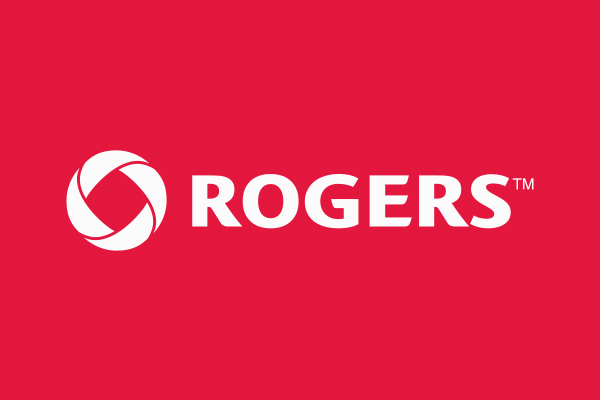

## Project Description

5G mobile networks are expected to support a wide range of applications and services beyond traditional voice and data services. They will offer services with diverse QoS requirements, such as enhanced mobile broadband (e.g., Ultra-HD video streaming, Augmented/Virtual-reality communications), ultra-reliable low-latency communications (e.g., tele-driving, tele-surgery), and massive machine-type communications (e.g., smart cities). The capability to support these services will open new revenue streams for mobile network operators as well as enable new industry verticals. In this context, network slicing is an enabling technology for accommodating different QoS requirements on the same physical network. Network slicing allows the partitioning of the physical network into multiple network slices, each supporting QoS tailored to an application or industry vertical. For example, emergency services could operate a network slice independent from others with a specific QoS, increased security and reliability to accommodate their operational needs. Network slicing provides network operators with increased control over the management and orchestration of network services.

Providing network services using 5G network slices involves several network slice life-cycle management steps, including slice instantiation, configuration and activation, followed by a run-time phase, and finally slice decommissioning. The diverse, demanding, and stringent QoS guarantees offered by 5G networks cannot be satisfied with traditional reactive human-in-the-loop management and operation approaches. Artificial Intelligence (AI) and Machine Learning (ML) will play a major role in 5G network operations and management to achieve network automation. The overarching goal of this project is to realize automated and data-driven 5G network life-cycle management, powered by recent advances in AI, ML, and large-scale data processing. It will address several challenging problems spanning slice orchestration, slice monitoring, and fault and performance management.

## Sponsors and Partners

  

    
  

  

    
  

